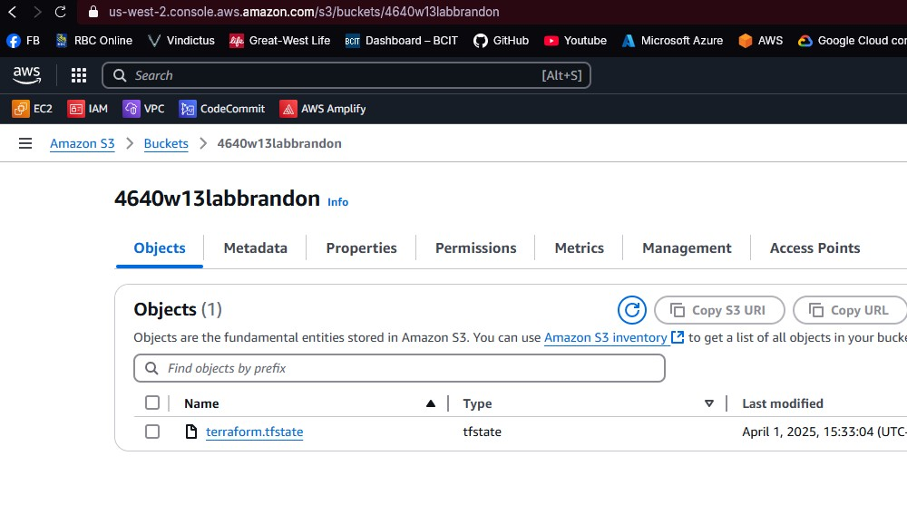
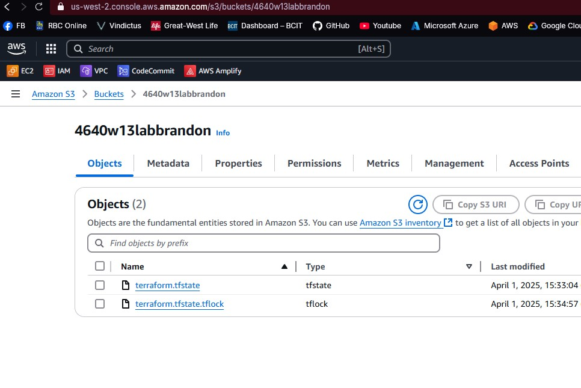

# 4640-w13-lab-start-w25

### When is the state file created?  
The state file is created after terraform has finished applying the terraform resources the first time.  

### When is the lock file present?  
The lock file becomes present after inputing terraform apply but before confirming the operation.  

### Is the lock file always in the bucket after it is created?  
No, The lock file is removed after completing the terraform apply and terraform destroy commands  

After terraform apply completed just statefile is present

Both files are present before saying yes to confirm terraform destroy
